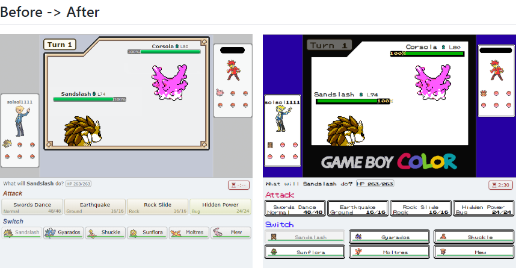
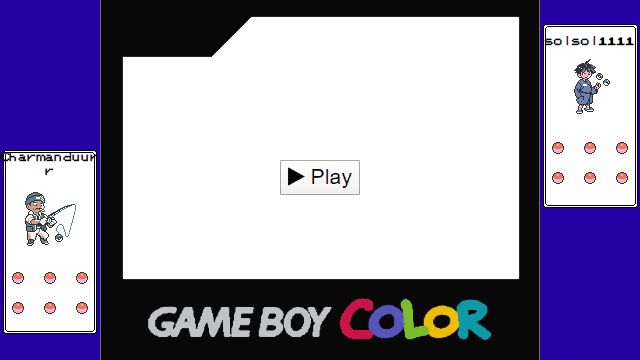

# showdown-gsc

Chrome extension that makes Pokemon Showdown PokemonGSC-style.





## Features

<small>GSC: Pokemon Gold & Silver & Crystal</small>  
<small>GBC: GameBoyColor</small>

- GSC-style avatar
- GSC-style icon
- GSC font
- GSC-style HPBar
- GBC background
- GSC-style Message
- GSC's SE
- GSC-style Menu
- 8bit BGM
- GSC-style intro

## Build

```bash
# Requirements: Nodejs & npm(yarn)
> npm install   # yarn install
> npm run build # yarn build
```

Then import the extension on your Chrome.
